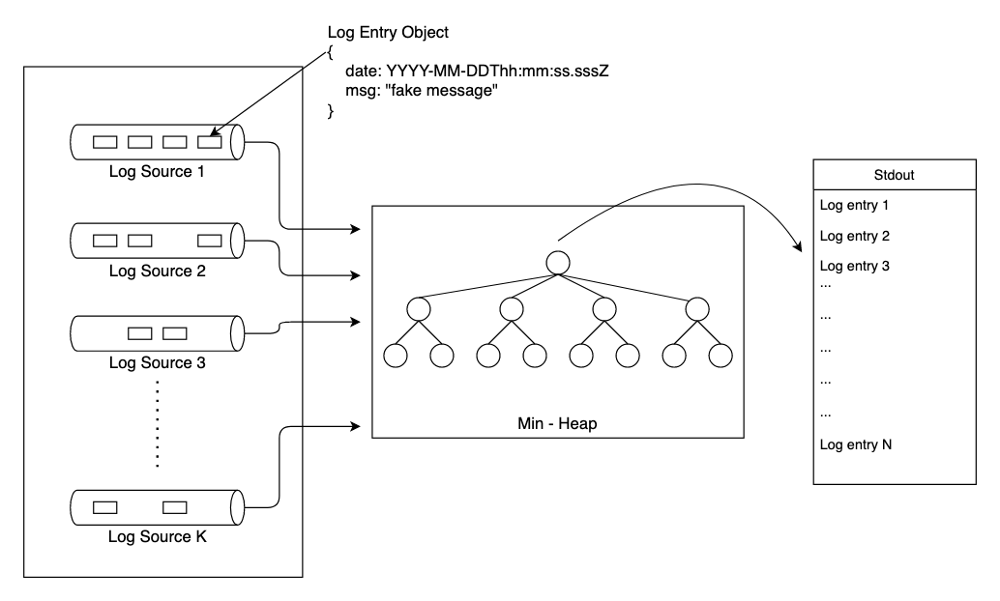

# Log Sorting

Log sorting - Chronologically sort 'K log sources' where each log source has 'N log entries'

## Description

We have a number of [**log sources**](https://github.com/jaspal-carleton/log_sorting/blob/master/lib/log-source.js).  Each log source contains N log entries.  Each entry is a javascript object with a timestamp and message.  We don't know the number of log entries each source contains - however - we do know that the entries within each source are sorted 🕒 **chronologically** 🕒.

### The Objectives:
1. ***Drain all of the log sources*** for both the synchronous and asynchronous solutions.
    - [Synchronous](https://github.com/jaspal-singh/log_sorting/lib/log-source.js#L37)
    - [Asynchronous](https://github.com/jaspal-singh/log_sorting/lib/log-source.js#L45)
1. Print all of the entries, across all of the sources, in chronological order.
    - We don't need to store the log entries, just print them to stdout.
1. Do this *efficiently*. There are time and space complexities afoot!

## Getting Started

### Dependencies

* bluebird
* Faker
* lodash
* jest

### Prerequisites

The app requires NodeJS and NPM to be installed on the system where this application will run.

* Verify if NodeJS and NPM is already installed on your system by executing following commands from the terminal. If installed then it will output the version number.

  ```sh
  node --version
  ```

  ```sh
  npm --version
  ```

* Otherwise, download and install NodeJS v15.0.0 from https://nodejs.org/download/release/v15.0.0/ based on your system OS. This will also install NPM by default along with NodeJS.

### Installing

1. Clone the repo
   ```sh
   git clone https://github.com/jaspal-carleton/log_sorting.git
   ```
2. Change directory to the project folder
   ```sh
   cd log_sorting
   ```
3. Install NodeJS modules or packages
   ```sh
   npm install
   ```

### Executing program

1. Run the app by executing following npm command from inside the project folder
   ```sh
   npm start
   ```

## Discussion

The given problem is similar to the situation where "K Sorted Arrays" have to be merged. However, there are few unique challenges associated to this problem. Few of which are discussed below.

### Challenges
    - Here we do not know the size of the Kth array because the input array (actually log source) is not in the form of static file. It is more of a continuous streaming log. As a result of which, we cannot predict the memory storage space requirements for this problem.
    - Due to the nature of draining the log entries from the input log sources, some of the log sources may get drained early than others. In other words, we cannot predict when the log streaming will stop for which of the log sources. Hence, it is not useful to iterate the entire array of log sources everytime when some of the input sources would have already been drained.

### Approach

Both, synchronous and asynchronous solution make use of Min-Heap data structure to chronologically extract the log entries and print them on the stdout. The high level system diagram is shown below. Both, the solution has time complexity of O(n*k log(k)), where 'k' is the number of log sources and 'n' is number of log entries in each log source.



1. Synchronous
Although, synchronous solution make use of Min-Heap, but it is a custom heap data strucutre where the heap size is efficiently kept constant and is limited to the count 'K' of the log sources. Therefore, it has space complexity of only O(k). Additionally, the synchronous solution make use of combination of Priority Queues along with Min-Heap to efficiently manage the memory space.

1. Asynchronous
The asynchronous solution is more challenging than the synchronous one. Due to the delay in generation of log entries from a given log source, the Min-Heap has to wait to receive the new node. Although, the adopted solution in not very efficient in terms of space complexity but it is able to achieve the same time complexity as the synchronous solution.


## Test Results

1. Synchronous
    - runSolutions(10)
    ***********************************
    Logs printed:		 2262
    Time taken (s):		 0.067
    Logs/s:			 33761.19402985075
    ***********************************
    ***********************************
    Logs printed:		 2452
    Time taken (s):		 0.074
    Logs/s:			 33135.13513513513
    ***********************************

    - runSolutions(100)
    ***********************************
    Logs printed:		 23993
    Time taken (s):		 0.334
    Logs/s:			 71835.32934131737
    ***********************************
    ***********************************
    Logs printed:		 24139
    Time taken (s):		 0.325
    Logs/s:			 74273.84615384616
    ***********************************

    - runSolutions(1000)
    ***********************************
    Logs printed:		 237934
    Time taken (s):		 2.514
    Logs/s:			 94643.59586316628
    ***********************************
    ***********************************
    Logs printed:		 238527
    Time taken (s):		 2.691
    Logs/s:			 88638.79598662208
    ***********************************

    - runSolutions(10000)
    ***********************************
    Logs printed:		 2386466
    Time taken (s):		 26.901
    Logs/s:			 88712.91030073231
    ***********************************
    ***********************************
    Logs printed:		 2393414
    Time taken (s):		 27.074
    Logs/s:			 88402.67415232326
    ***********************************

1. Asynchronous
    - runSolutions(10)
    ***********************************
    Logs printed:		 2434
    Time taken (s):		 0.068
    Logs/s:			 35794.11764705882
    ***********************************
    ***********************************
    Logs printed:		 2309
    Time taken (s):		 0.065
    Logs/s:			 35523.07692307692
    ***********************************

    - runSolutions(100)
    ***********************************
    Logs printed:		 23997
    Time taken (s):		 0.336
    Logs/s:			 71419.64285714286
    ***********************************
    ***********************************
    Logs printed:		 24341
    Time taken (s):		 0.348
    Logs/s:			 69945.40229885057
    ***********************************

    - runSolutions(1000)
    ***********************************
    Logs printed:		 238358
    Time taken (s):		 2.878
    Logs/s:			 82820.70882557331
    ***********************************
    ***********************************
    Logs printed:		 239626
    Time taken (s):		 2.806
    Logs/s:			 85397.71917320028
    ***********************************

    - runSolutions(10000)
    ***********************************
    Logs printed:		 2403871
    Time taken (s):		 34.235
    Logs/s:			 70216.76646706587
    ***********************************
    ***********************************
    Logs printed:		 2405670
    Time taken (s):		 32.168
    Logs/s:			 74784.56851529471
    ***********************************

## Future Enhancements

To make the asynchronous solution more efficient, the event driven publisher-subscriber system can be implemented. Briefly, the asynchronous log sources can be spread across multiple processes to be processed parallely (driver node and worker node pattern) where they publish to an event queue or topic. Once the log entry is placed in the queue or topic it will generate an event. The Min-Heap system would have subscribed to the queue (or topic) and upon receiving an event it can process the payload to create a node and add it to the heap. Simultaneously, printing it to the stdout. Therefore, in this kind of system the publisher and subscriber systems are independent and not tightly integrated, which improves the time-space complexity.